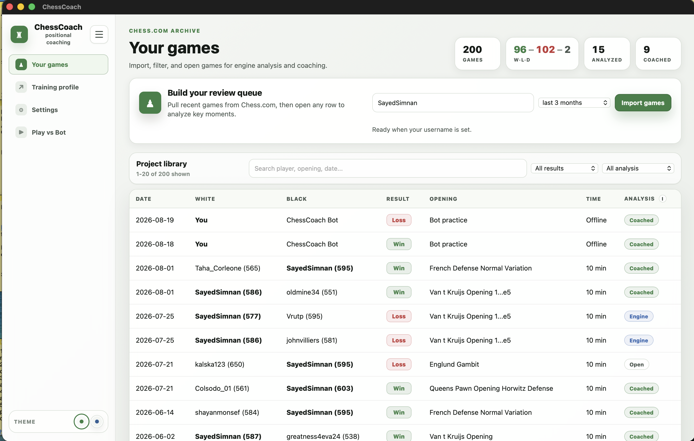
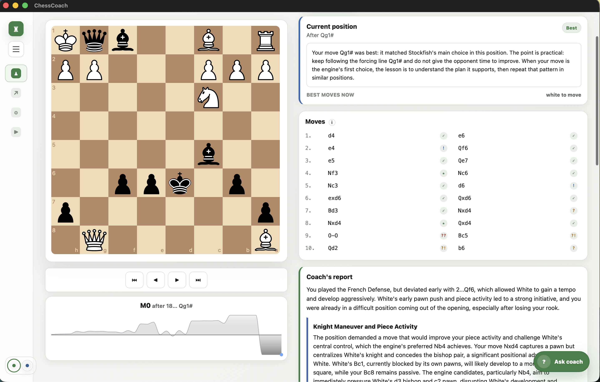
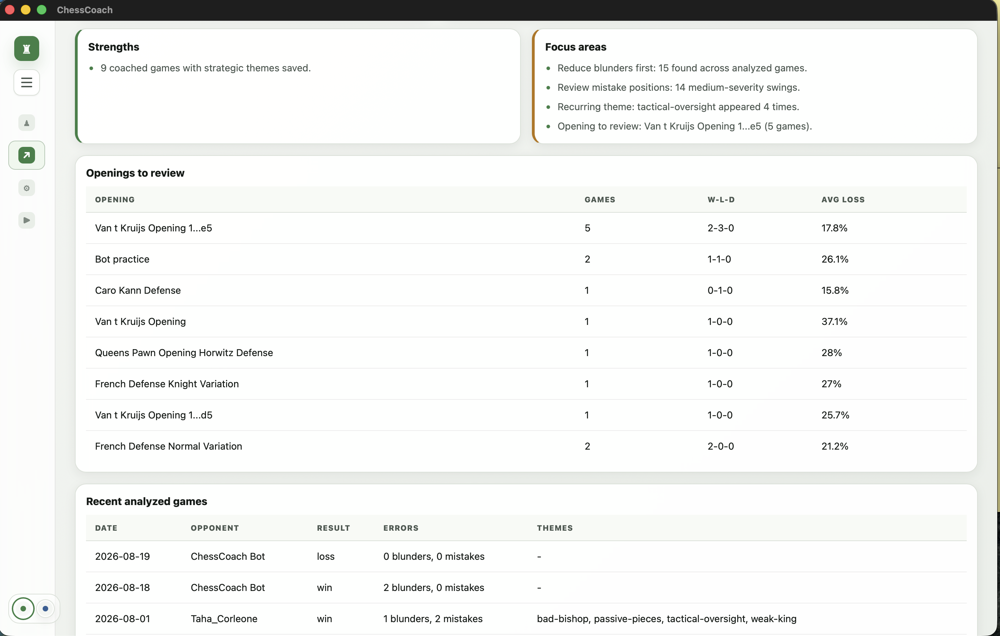
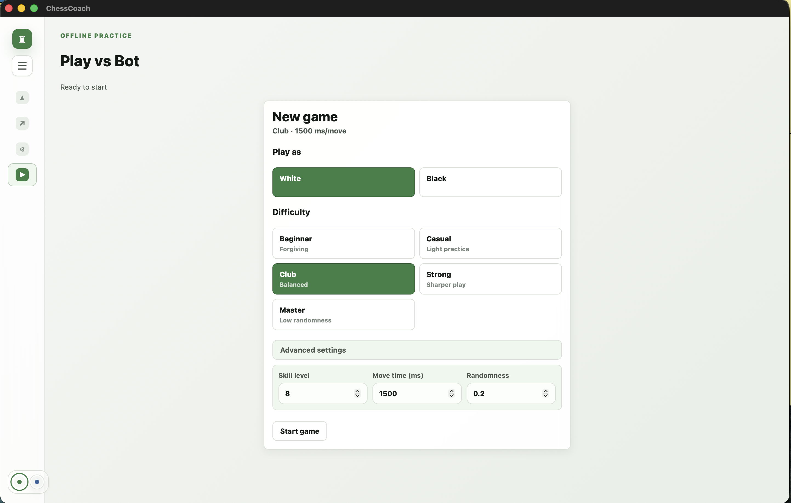
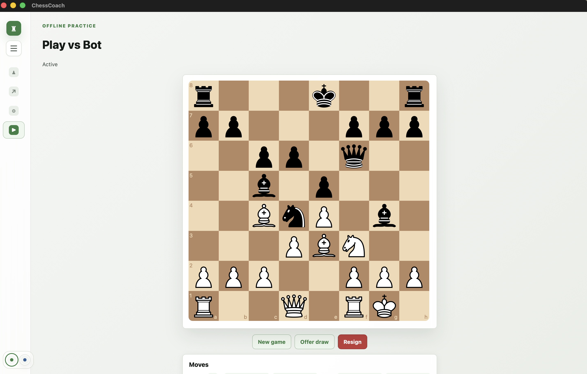
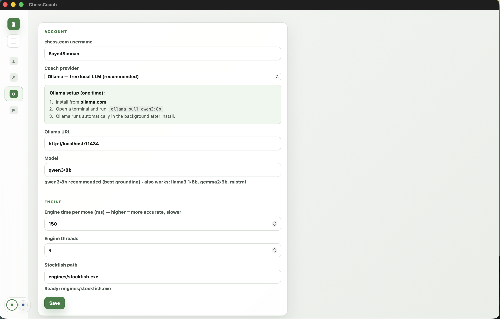

# ChessCoach

ChessCoach is a local-first chess coaching app that runs as both a desktop app and a web app. It imports Chess.com games, stores them locally in SQLite, analyzes positions with Stockfish, and uses local or hosted LLMs to explain the strategic reason behind key moments.

It is not a simple AI API wrapper. The app coordinates a FastAPI backend, a React analysis UI, a `pywebview` desktop shell, a local Stockfish UCI process, deterministic chess feature extraction, background analysis jobs, and model-provider fallbacks.

## Why I Built This

- I built this for a friend who loves chess.
- He has a good computer, but his internet is not always reliable in his hometown.
- Most chess tools need a strong internet connection.
- He wanted a desktop app that could use his own computer for analysis.
- He wanted to import his Chess.com games and keep them locally.
- He wanted to review openings and understand how his games developed.
- He wanted to find mistakes, inaccuracies, blunders, and strong moves.
- He wanted clear reports, not just engine numbers.
- He wanted to ask questions about the real board position.
- He wanted to keep studying even when the internet was bad or not availabe.

That is why I built ChessCoach: a local-first chess coach for studying real games on desktop or in the browser.

The main technical challenge was making the AI trustworthy. Local models can guess wrong about pieces, squares, threats, or legal moves. So ChessCoach uses Stockfish as the source of truth, extracts real board facts first, and asks the AI to explain the verified analysis instead of inventing its own chess judgment.

## Screenshots

### Home



### Game Analysis



### Training Profile



### Bot Play





### Settings



## What It Does

- Imports public Chess.com games by username.
- Stores games, moves, engine evaluations, reports, and profile data locally in SQLite.
- Runs Stockfish analysis for move grading, principal variations, best moves, and evaluation swings.
- Shows move grades, win-probability loss, evaluations, and best-line suggestions.
- Generates coaching reports for the most important moments in a game.
- Explains plans, pawn structures, piece activity, weak squares, files, king safety, and recurring themes.
- Builds a cross-game Training Profile from stored games and strategic patterns.
- Supports human-versus-bot play for practice inside the same app.
- Runs as a local desktop app, while also supporting browser-based web development.
- Supports local Ollama models and optional hosted Claude or Gemini coaching.

## Engineering Highlights

- **Desktop + web architecture:** FastAPI serves the backend, React powers the UI, and `pywebview` wraps the app for desktop use.
- **Local-first storage:** SQLite keeps imported games, analysis, settings, and training profile data on the user's machine.
- **Stockfish authority model:** Stockfish provides evaluations, best moves, principal variations, and move classifications.
- **Grounded AI coaching:** Prompts include deterministic board facts, exact piece placement, legal move consequences, and engine lines to reduce hallucinations.
- **Provider flexibility:** Ollama supports offline local coaching, while Claude and Gemini are available as hosted quality paths.
- **Interactive study workflow:** The frontend combines a board, move list, eval graph, coaching report, profile pages, settings, and bot play.

## How Coaching Works

ChessCoach separates chess judgment from natural-language explanation:

1. Chess.com games are imported and stored locally.
2. Stockfish analyzes each move and candidate line.
3. The backend classifies mistakes, inaccuracies, blunders, strong moves, and key moments.
4. `backend/features.py` extracts verified facts about the board, including material, piece placement, pawn structure, open files, weak squares, king safety, and move consequences.
5. The selected LLM receives the engine analysis and fact packet.
6. The LLM explains the position in human terms without being treated as the chess authority.

That design lets smaller local models stay useful because they are explaining reliable information instead of guessing from scratch.

## Coaching Backends

ChessCoach can use one of these providers:

- `ollama`: local model through Ollama.
- `gemini`: Google Gemini API.

The selected provider is controlled by app settings or by `.env`.

## Requirements

- Python 3.11+
- Node 20+
- Stockfish binary
- One coaching backend:
  - Ollama and a local model, or
  - Anthropic API key, or
  - Gemini API key

On Windows, the desktop shell uses WebView2 through `pywebview`. On macOS and Linux, the backend and frontend can also be run directly in a browser.

## Setup

Create the Python environment:

```bash
python -m venv .venv
.venv/bin/python -m pip install -r requirements.txt
```

On Windows:

```powershell
python -m venv .venv
.venv\Scripts\python.exe -m pip install -r requirements.txt
```

Install frontend dependencies:

```bash
cd frontend
npm install
cd ..
```

Add Stockfish:

- Download Stockfish from `https://stockfishchess.org/download/`.
- Put the binary in `engines/`.
- Configure the Stockfish path in the app settings or make sure the default path matches your platform.

## Environment Variables

Create a root `.env` file. A template is included in `.env.example`.

For Gemini:

```env
COACH_PROVIDER=gemini
GEMINI_API_KEY=your-gemini-api-key
GEMINI_MODEL=gemini-2.5-flash-lite
GEMINI_FALLBACK_MODELS=gemini-3.5-flash,gemini-3.1-flash-lite,gemini-2.5-flash
```

For Claude:

```env
COACH_PROVIDER=claude
ANTHROPIC_API_KEY=your-anthropic-api-key
```

For Ollama:

```env
COACH_PROVIDER=ollama
```

Then pull a local model:

```bash
ollama pull qwen3:8b
```

Runtime `.env` values override `settings.json`. Secrets are not written back into `settings.json`.

## Run The Desktop App

Build the frontend bundle:

```bash
cd frontend
npm run build
cd ..
```

Start the desktop app:

```bash
.venv/bin/python desktop.py
```

On Windows:

```powershell
.venv\Scripts\python.exe desktop.py
```

## Run As A Web App

Start the backend:

```bash
.venv/bin/python -m uvicorn backend.app:app --host 127.0.0.1 --port 8421
```

Start the frontend:

```bash
cd frontend
npm run dev
```

Then open the Vite URL shown in the terminal.

## Workflow

1. Enter a Chess.com username.
2. Import recent games.
3. Open a game.
4. Run Stockfish analysis.
5. Review move grades, evaluations, and best lines.
6. Read the generated coaching report.
7. Use the Training Profile to find recurring weaknesses.
8. Practice with bot play.

The game list is scoped to the configured Chess.com username. If the local database has games from multiple usernames, the UI only shows games where the configured user played White or Black.

## Data Storage

Local data is stored in `chesscoach.db`.

Settings are stored in `settings.json`, except secrets provided by `.env`.

The database stores:

- games
- moves
- engine evaluations
- coaching reports
- strategic themes
- training profile data
- bot games

## Project Structure

- `backend/app.py`: FastAPI application setup.
- `backend/api/`: API routes for games, analysis, coaching, play, settings, and onboarding.
- `backend/chesscom.py`: Chess.com import logic.
- `backend/storage/`: SQLite connection, schema, migrations, cache, games, profile, and bot-game storage.
- `backend/engine.py`: Stockfish analysis and move classification.
- `backend/features.py`: deterministic board facts used to ground coaching.
- `backend/coach.py`: LLM provider calls and coaching orchestration.
- `frontend/src/features/analysis/`: game review, board analysis, eval graph, move list, and coach panel.
- `frontend/src/features/games/`: imported game list and game view.
- `frontend/src/features/play/`: human-versus-bot play.
- `frontend/src/features/profile/`: Training Profile UI.
- `frontend/src/features/settings/`: app settings UI.
- `desktop.py`: desktop wrapper for the local app.
- `tests/`: backend and frontend-adjacent tests.

## Development

Run backend tests:

```bash
.venv/bin/python -m pytest
```

Run frontend checks:

```bash
cd frontend
npm run lint
npm run typecheck
npm run build
```

Run backend only:

```bash
.venv/bin/python -m uvicorn backend.app:app --host 127.0.0.1 --port 8421
```

Run frontend only:

```bash
cd frontend
npm run dev
```

## Notes

- Chess.com game data comes from the public Chess.com API.
- Stockfish is not bundled with this project.
- Hosted LLM providers may rate-limit, fail during high demand, or charge per request.
- Gemini calls retry transient failures and can fall back through configured models.
- Ollama quality depends heavily on the local model and hardware.

## License

ChessCoach code is MIT licensed. Stockfish is GPLv3 and is invoked as a separate external binary that you provide yourself.
