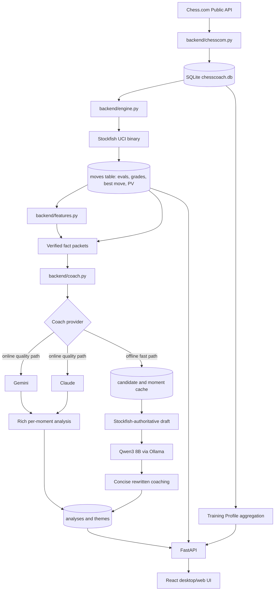

# ChessCoach Architecture

ChessCoach is a local-first chess analysis app. It combines a public game source, a local database, an external chess engine process, deterministic board feature extraction, and local or hosted LLM coaching.

## Coaching Authority Model

Stockfish is the authority for chess judgment. It decides the best move, principal variation,
evaluation swing, move classification, and winning-chance loss. `backend/features.py` adds
deterministic board facts such as piece placement, pawn structure, files, outposts, king safety, and
move consequences.

The LLM is not the chess engine. Its job is to turn verified Stockfish and feature data into useful
coaching prose without inventing unsupported claims.

## Provider Paths

Online providers use the quality path. Claude and Gemini can receive richer prompts and produce
deeper per-moment strategic analysis because they are fast enough and stronger at long-context
reasoning.

Offline Ollama uses the fast path. It should keep `qwen3:8b` as the first local target on a 16 GB
laptop, but only as a rewrite layer: Stockfish and `features.py` provide the facts, then Qwen writes a
short human explanation. This keeps local quality decent while avoiding repeated large prompts.

The offline path should prioritize:

- fewer default moments: top 3 negative and top 1 positive
- cached Stockfish candidate results
- cached per-moment Qwen rewrites
- compact fact packets instead of full repeated coaching prompts
- optional on-demand deepening for a single selected moment

## Why This Is Resume-Relevant

- Stockfish is controlled as a local UCI process, not consumed as a hosted API.
- Ollama support proves local LLM orchestration with long prompts and JSON output.
- Deterministic board facts ground LLM coaching so explanations are auditable.
- SQLite keeps analysis local and enables cross-game player profiling.
- The React UI turns engine data into an interactive study workflow.
