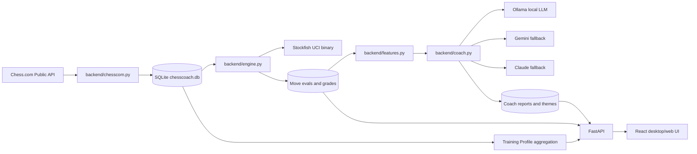

# ChessCoach Architecture

ChessCoach is a local-first chess analysis app. It combines a public game source, a local database, an external chess engine process, deterministic board feature extraction, and local or hosted LLM coaching.

## Why This Is Resume-Relevant

- Stockfish is controlled as a local UCI process, not consumed as a hosted API.
- Ollama support proves local LLM orchestration with long prompts and JSON output.
- Deterministic board facts ground LLM coaching so explanations are auditable.
- SQLite keeps analysis local and enables cross-game player profiling.
- The React UI turns engine data into an interactive study workflow.
