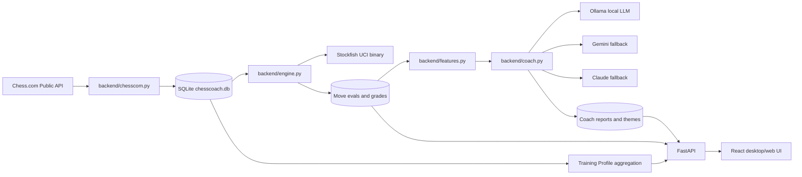

# ChessCoach Resume-Ready Implementation Plan

> **For agentic workers:** REQUIRED SUB-SKILL: Use superpowers:subagent-driven-development (recommended) or superpowers:executing-plans to implement this plan task-by-task. Steps use checkbox (`- [ ]`) syntax for tracking.

**Goal:** Make ChessCoach resume-ready by adding a cross-game Training Profile first, improving Stockfish setup second, then polishing demo, docs, tests, and cleanup.

**Architecture:** Keep the current local-first FastAPI + SQLite + React structure. Add backend aggregation APIs for player insights, then add a React profile screen that summarizes recurring weaknesses, openings, move quality, and improvement signals across analyzed games.

**Tech Stack:** Python 3.11+, FastAPI, SQLite, python-chess, Stockfish UCI, Ollama/Claude/Gemini coaching providers, React, Vite, Recharts, pytest, ESLint.

## Global Constraints

- Keep the project local-first: no new hosted service is required for core functionality.
- Prefer existing dependencies; do not add a charting library because `recharts` is already installed.
- Do not bundle Stockfish; invoke a user-provided external binary.
- Keep secrets out of `settings.json`; `.env` and process environment override file settings.
- Preserve current app flow: import games, run engine analysis, get coaching.
- Each task must pass its listed tests before moving to the next task.
- Commit after each task with the listed commit message.

---

## File Structure

- Modify `backend/db.py`: add profile aggregation helpers that query `games`, `moves`, `analyses`, and `themes`.
- Modify `backend/app.py`: add `GET /api/profile` and Stockfish setup fields/status.
- Modify `backend/settings.py`: add `stockfish_path` and `STOCKFISH_PATH`.
- Modify `backend/engine.py`: resolve Stockfish path from settings and validate it before launching.
- Create `tests/test_profile.py`: backend tests for profile aggregation.
- Create `tests/test_stockfish_settings.py`: backend tests for Stockfish path resolution.
- Modify `frontend/src/api.js`: add `profile()` client method.
- Modify `frontend/src/App.jsx`: add `#/profile` route and topbar button.
- Create `frontend/src/components/Profile.jsx`: Training Profile screen.
- Modify `frontend/src/components/Settings.jsx`: Stockfish path input and status.
- Modify `frontend/src/components/Onboarding.jsx`: include Stockfish readiness.
- Modify `frontend/src/index.css`: profile and settings styles.
- Modify `README.md`: stronger portfolio story, screenshots section, architecture diagram, setup notes.
- Modify `.env.example` and `settings.example.json`: Ollama-first defaults and `stockfish_path`.
- Remove unused starter assets only if imports confirm they are unused.

---

### Task 1: Backend Training Profile Aggregation

**Files:**
- Modify: `backend/db.py`
- Create: `tests/test_profile.py`

**Interfaces:**
- Produces: `db.get_profile(conn: sqlite3.Connection, username: str | None = None, limit_games: int = 200) -> dict`
- Produces response shape:

```python
{
    "summary": {
        "games": 0,
        "analyzed": 0,
        "coached": 0,
        "wins": 0,
        "losses": 0,
        "draws": 0,
        "blunders": 0,
        "mistakes": 0,
        "inaccuracies": 0,
        "avg_win_pct_loss": 0.0,
    },
    "move_quality": [
        {"classification": "blunder", "count": 0},
    ],
    "themes": [
        {"slug": "weak-king", "count": 2, "decisive": 1, "significant": 1, "minor": 0},
    ],
    "openings": [
        {"opening": "Sicilian Defense", "games": 3, "wins": 1, "losses": 2, "draws": 0, "avg_loss": 8.4},
    ],
    "recent": [
        {"game_id": 1, "played_at": "2026-01-01 12:00:00", "opponent": "rival", "result": "loss", "blunders": 1, "mistakes": 2, "themes": ["weak-king"]},
    ],
}
```

- Consumes: existing tables in `backend/db.py`.

- [ ] **Step 1: Write failing profile aggregation tests**

Create `tests/test_profile.py`:

```python
import sqlite3

from backend import db


def make_conn():
    conn = sqlite3.connect(":memory:")
    conn.row_factory = sqlite3.Row
    conn.execute("PRAGMA foreign_keys = ON")
    conn.executescript(db.SCHEMA)
    return conn


def insert_game(conn, game_id, white, black, result, opening, played_at, user_color):
    conn.execute(
        """INSERT INTO games
           (id, source, source_url, pgn, white, black, result, opening, played_at, user_color, engine_analyzed)
           VALUES (?, 'chess.com', ?, ?, ?, ?, ?, ?, ?, ?, 1)""",
        (game_id, f"https://game/{game_id}", "1. e4 e5 *", white, black, result, opening, played_at, user_color),
    )


def insert_move(conn, game_id, ply, classification, loss):
    conn.execute(
        """INSERT INTO moves
           (game_id, ply, san, uci, fen_after, classification, win_pct_loss)
           VALUES (?, ?, 'e4', 'e2e4', 'fen', ?, ?)""",
        (game_id, ply, classification, loss),
    )


def test_profile_counts_user_results_move_quality_themes_and_openings():
    conn = make_conn()
    insert_game(conn, 1, "kishan", "rival1", "1-0", "Italian Game", "2026-01-01 12:00:00", "white")
    insert_game(conn, 2, "rival2", "kishan", "1-0", "Sicilian Defense", "2026-01-02 12:00:00", "black")
    insert_move(conn, 1, 1, "best", 0)
    insert_move(conn, 1, 3, "mistake", 21.5)
    insert_move(conn, 2, 2, "blunder", 34.0)
    insert_move(conn, 2, 4, "inaccuracy", 12.0)
    conn.execute(
        "INSERT INTO analyses (game_id, commentary, model, input_tokens, output_tokens) VALUES (1, '{}', 'qwen', 10, 5)"
    )
    conn.execute(
        "INSERT INTO themes (game_id, slug, side, severity, ply_start, ply_end, note) VALUES (1, 'weak-king', 'user', 'decisive', 3, 3, 'king exposed')"
    )
    conn.commit()

    profile = db.get_profile(conn, username="kishan")

    assert profile["summary"]["games"] == 2
    assert profile["summary"]["analyzed"] == 2
    assert profile["summary"]["coached"] == 1
    assert profile["summary"]["wins"] == 1
    assert profile["summary"]["losses"] == 1
    assert profile["summary"]["draws"] == 0
    assert profile["summary"]["blunders"] == 1
    assert profile["summary"]["mistakes"] == 1
    assert profile["summary"]["inaccuracies"] == 1
    assert profile["summary"]["avg_win_pct_loss"] == 22.5
    assert profile["move_quality"][0] == {"classification": "blunder", "count": 1}
    assert profile["themes"][0]["slug"] == "weak-king"
    assert profile["themes"][0]["decisive"] == 1
    assert profile["openings"][0]["opening"] == "Sicilian Defense"
    assert profile["openings"][0]["losses"] == 1
    assert profile["recent"][0]["game_id"] == 2
    assert profile["recent"][0]["opponent"] == "rival2"
```

- [ ] **Step 2: Run test to verify it fails**

Run: `.venv/bin/python -m pytest tests/test_profile.py -v`

Expected: FAIL with `AttributeError: module 'backend.db' has no attribute 'get_profile'`.

- [ ] **Step 3: Implement `db.get_profile`**

Add this function to `backend/db.py` after `get_game`:

```python
def get_profile(conn: sqlite3.Connection, username: str | None = None,
                limit_games: int = 200) -> dict:
    name = username.strip().lower() if username else None
    user_where = ""
    user_params: list = []
    if name:
        user_where = "WHERE lower(g.white) = ? OR lower(g.black) = ?"
        user_params = [name, name]

    games = [dict(r) for r in conn.execute(
        f"""SELECT g.*,
                  EXISTS(SELECT 1 FROM analyses a WHERE a.game_id = g.id) AS coached
           FROM games g
           {user_where}
           ORDER BY g.played_at DESC
           LIMIT ?""",
        [*user_params, limit_games],
    ).fetchall()]

    game_ids = [g["id"] for g in games]
    if not game_ids:
        return {
            "summary": {
                "games": 0, "analyzed": 0, "coached": 0, "wins": 0, "losses": 0,
                "draws": 0, "blunders": 0, "mistakes": 0, "inaccuracies": 0,
                "avg_win_pct_loss": 0.0,
            },
            "move_quality": [],
            "themes": [],
            "openings": [],
            "recent": [],
        }

    placeholders = ",".join("?" for _ in game_ids)

    def user_color_for(g: dict) -> str | None:
        if name == (g.get("white") or "").lower():
            return "white"
        if name == (g.get("black") or "").lower():
            return "black"
        return g.get("user_color")

    def is_user_move(ply: int, color: str | None) -> bool:
        if color is None:
            return True
        return (color == "white") == (ply % 2 == 1)

    def result_for(g: dict) -> str:
        if g.get("result") == "1/2-1/2" or not user_color_for(g):
            return "draw"
        user_won = (user_color_for(g) == "white") == (g.get("result") == "1-0")
        return "win" if user_won else "loss"

    moves_by_game: dict[int, list[dict]] = {gid: [] for gid in game_ids}
    for r in conn.execute(
        f"""SELECT game_id, ply, classification, win_pct_loss
            FROM moves
            WHERE game_id IN ({placeholders})""",
        game_ids,
    ):
        moves_by_game[r["game_id"]].append(dict(r))

    classifications = {"blunder": 0, "mistake": 0, "inaccuracy": 0, "best": 0, "great": 0,
                       "brilliant": 0, "good": 0}
    losses = []
    for g in games:
        color = user_color_for(g)
        for m in moves_by_game[g["id"]]:
            if not is_user_move(m["ply"], color):
                continue
            cls = m.get("classification")
            if cls in classifications:
                classifications[cls] += 1
            if cls in {"blunder", "mistake", "inaccuracy"} and m.get("win_pct_loss") is not None:
                losses.append(float(m["win_pct_loss"]))

    theme_rows = [dict(r) for r in conn.execute(
        f"""SELECT slug,
                  COUNT(*) AS count,
                  SUM(CASE WHEN severity = 'decisive' THEN 1 ELSE 0 END) AS decisive,
                  SUM(CASE WHEN severity = 'significant' THEN 1 ELSE 0 END) AS significant,
                  SUM(CASE WHEN severity = 'minor' THEN 1 ELSE 0 END) AS minor
            FROM themes
            WHERE game_id IN ({placeholders})
              AND (side IS NULL OR side IN ('user', 'both'))
            GROUP BY slug
            ORDER BY count DESC, slug ASC
            LIMIT 12""",
        game_ids,
    ).fetchall()]

    openings = []
    for opening in sorted({g.get("opening") or g.get("eco") or "Unknown" for g in games}):
        group = [g for g in games if (g.get("opening") or g.get("eco") or "Unknown") == opening]
        opening_losses = []
        for g in group:
            color = user_color_for(g)
            for m in moves_by_game[g["id"]]:
                if is_user_move(m["ply"], color) and m.get("classification") in {"blunder", "mistake", "inaccuracy"}:
                    opening_losses.append(float(m.get("win_pct_loss") or 0))
        openings.append({
            "opening": opening,
            "games": len(group),
            "wins": sum(1 for g in group if result_for(g) == "win"),
            "losses": sum(1 for g in group if result_for(g) == "loss"),
            "draws": sum(1 for g in group if result_for(g) == "draw"),
            "avg_loss": round(sum(opening_losses) / len(opening_losses), 1) if opening_losses else 0.0,
        })
    openings.sort(key=lambda o: (o["losses"], o["avg_loss"], o["games"]), reverse=True)

    themes_by_game: dict[int, list[str]] = {gid: [] for gid in game_ids}
    for r in conn.execute(
        f"""SELECT game_id, slug FROM themes
            WHERE game_id IN ({placeholders})
              AND (side IS NULL OR side IN ('user', 'both'))
            ORDER BY slug""",
        game_ids,
    ):
        themes_by_game[r["game_id"]].append(r["slug"])

    recent = []
    for g in games[:10]:
        color = user_color_for(g)
        user_moves = [m for m in moves_by_game[g["id"]] if is_user_move(m["ply"], color)]
        opponent = g.get("black") if color == "white" else g.get("white")
        recent.append({
            "game_id": g["id"],
            "played_at": g.get("played_at"),
            "opponent": opponent or "",
            "result": result_for(g),
            "blunders": sum(1 for m in user_moves if m.get("classification") == "blunder"),
            "mistakes": sum(1 for m in user_moves if m.get("classification") == "mistake"),
            "themes": themes_by_game[g["id"]][:4],
        })

    return {
        "summary": {
            "games": len(games),
            "analyzed": sum(1 for g in games if g.get("engine_analyzed")),
            "coached": sum(1 for g in games if g.get("coached")),
            "wins": sum(1 for g in games if result_for(g) == "win"),
            "losses": sum(1 for g in games if result_for(g) == "loss"),
            "draws": sum(1 for g in games if result_for(g) == "draw"),
            "blunders": classifications["blunder"],
            "mistakes": classifications["mistake"],
            "inaccuracies": classifications["inaccuracy"],
            "avg_win_pct_loss": round(sum(losses) / len(losses), 1) if losses else 0.0,
        },
        "move_quality": [
            {"classification": cls, "count": count}
            for cls, count in classifications.items()
            if count
        ],
        "themes": theme_rows,
        "openings": openings[:8],
        "recent": recent,
    }
```

- [ ] **Step 4: Run profile tests**

Run: `.venv/bin/python -m pytest tests/test_profile.py -v`

Expected: PASS.

- [ ] **Step 5: Run existing backend tests**

Run: `.venv/bin/python -m pytest tests -v`

Expected: PASS.

- [ ] **Step 6: Commit**

```bash
git add backend/db.py tests/test_profile.py
git commit -m "feat: add training profile aggregation"
```

---

### Task 2: Profile API Endpoint

**Files:**
- Modify: `backend/app.py`
- Modify: `tests/test_profile.py`

**Interfaces:**
- Consumes: `db.get_profile(conn, username)`
- Produces: `GET /api/profile -> dict`

- [ ] **Step 1: Add failing API test**

Append to `tests/test_profile.py`:

```python
def test_profile_endpoint_uses_configured_username(monkeypatch):
    from fastapi.testclient import TestClient
    from backend import app as app_module

    conn = make_conn()
    insert_game(conn, 1, "kishan", "rival", "1-0", "Italian Game", "2026-01-01 12:00:00", "white")
    insert_move(conn, 1, 1, "best", 0)
    conn.commit()

    class ConnCtx:
        def __enter__(self):
            return conn

        def __exit__(self, *args):
            return False

    monkeypatch.setattr(app_module.settings, "load", lambda: {"chesscom_username": "kishan"})
    monkeypatch.setattr(app_module.db, "connect", lambda: ConnCtx())

    client = TestClient(app_module.app)
    response = client.get("/api/profile")

    assert response.status_code == 200
    assert response.json()["summary"]["games"] == 1
```

- [ ] **Step 2: Run test to verify it fails**

Run: `.venv/bin/python -m pytest tests/test_profile.py::test_profile_endpoint_uses_configured_username -v`

Expected: FAIL with HTTP 404.

- [ ] **Step 3: Add route**

In `backend/app.py`, after `games()` and before `game(game_id)`, add:

```python
@app.get("/api/profile")
def profile():
    username = settings.load().get("chesscom_username")
    with db.connect() as conn:
        return db.get_profile(conn, username=username)
```

- [ ] **Step 4: Run API test**

Run: `.venv/bin/python -m pytest tests/test_profile.py::test_profile_endpoint_uses_configured_username -v`

Expected: PASS.

- [ ] **Step 5: Run backend tests**

Run: `.venv/bin/python -m pytest tests -v`

Expected: PASS.

- [ ] **Step 6: Commit**

```bash
git add backend/app.py tests/test_profile.py
git commit -m "feat: expose training profile API"
```

---

### Task 3: React Training Profile Page

**Files:**
- Modify: `frontend/src/api.js`
- Modify: `frontend/src/App.jsx`
- Create: `frontend/src/components/Profile.jsx`
- Modify: `frontend/src/index.css`

**Interfaces:**
- Consumes: `GET /api/profile`
- Produces: `#/profile` screen with summary cards, theme chart, opening table, and recent game list.

- [ ] **Step 1: Add API method**

In `frontend/src/api.js`, add:

```javascript
profile: () => request('/api/profile'),
```

- [ ] **Step 2: Create `Profile.jsx`**

Create `frontend/src/components/Profile.jsx`:

```jsx
import { useEffect, useMemo, useState } from 'react'
import { Bar, BarChart, CartesianGrid, ResponsiveContainer, Tooltip, XAxis, YAxis } from 'recharts'
import { api } from '../api.js'

function Stat({ label, value }) {
  return (
    <div className="stat-card">
      <div className="stat-num">{value}</div>
      <div className="stat-label">{label}</div>
    </div>
  )
}

export default function Profile({ onOpenGame }) {
  const [profile, setProfile] = useState(null)
  const [error, setError] = useState('')

  useEffect(() => {
    api.profile().then(setProfile).catch((e) => setError(e.message))
  }, [])

  const themeData = useMemo(() => (profile?.themes || []).slice(0, 8), [profile])

  if (error) return <div className="status-line error">{error}</div>
  if (!profile) {
    return (
      <div className="profile-page">
        <div className="skeleton" style={{ height: 120, borderRadius: 8 }} />
        <div className="skeleton" style={{ height: 320, borderRadius: 8 }} />
      </div>
    )
  }

  const s = profile.summary
  const hasData = s.games > 0

  return (
    <div className="profile-page">
      <div className="page-head">
        <div>
          <p className="eyebrow">Training profile</p>
          <h2>Recurring patterns</h2>
        </div>
        <div className="stats-strip">
          <Stat label="Games" value={s.games} />
          <Stat label="Analyzed" value={s.analyzed} />
          <Stat label="Coached" value={s.coached} />
          <Stat label="Avg loss" value={`${s.avg_win_pct_loss}%`} />
        </div>
      </div>

      {!hasData && (
        <div className="card empty-profile">
          Import games, run engine analysis, and generate coaching to build your profile.
        </div>
      )}

      {hasData && (
        <>
          <div className="profile-grid">
            <div className="card profile-card">
              <h3>Move quality</h3>
              <div className="quality-list">
                <span>Blunders <strong>{s.blunders}</strong></span>
                <span> mistakes <strong>{s.mistakes}</strong></span>
                <span> inaccuracies <strong>{s.inaccuracies}</strong></span>
              </div>
              <p className="status-line">
                Record: {s.wins} wins, {s.losses} losses, {s.draws} draws.
              </p>
            </div>

            <div className="card profile-card">
              <h3>Top themes</h3>
              {themeData.length ? (
                <div className="theme-chart">
                  <ResponsiveContainer width="100%" height={220}>
                    <BarChart data={themeData} layout="vertical" margin={{ left: 12, right: 12 }}>
                      <CartesianGrid strokeDasharray="3 3" horizontal={false} />
                      <XAxis type="number" allowDecimals={false} />
                      <YAxis dataKey="slug" type="category" width={132} tick={{ fontSize: 12 }} />
                      <Tooltip />
                      <Bar dataKey="count" fill="var(--accent)" radius={[0, 4, 4, 0]} />
                    </BarChart>
                  </ResponsiveContainer>
                </div>
              ) : (
                <p className="status-line">Generate coaching on analyzed games to collect themes.</p>
              )}
            </div>
          </div>

          <div className="card">
            <h3>Openings to review</h3>
            <table className="game-table compact-table">
              <thead>
                <tr><th>Opening</th><th>Games</th><th>W-L-D</th><th>Avg loss</th></tr>
              </thead>
              <tbody>
                {profile.openings.map((o) => (
                  <tr key={o.opening}>
                    <td>{o.opening}</td>
                    <td>{o.games}</td>
                    <td>{o.wins}-{o.losses}-{o.draws}</td>
                    <td>{o.avg_loss}%</td>
                  </tr>
                ))}
              </tbody>
            </table>
          </div>

          <div className="card">
            <h3>Recent analyzed games</h3>
            <table className="game-table compact-table">
              <thead>
                <tr><th>Date</th><th>Opponent</th><th>Result</th><th>Errors</th><th>Themes</th></tr>
              </thead>
              <tbody>
                {profile.recent.map((g) => (
                  <tr key={g.game_id} className="row" onClick={() => onOpenGame(g.game_id)}>
                    <td>{(g.played_at || '').slice(0, 10)}</td>
                    <td>{g.opponent}</td>
                    <td>{g.result}</td>
                    <td>{g.blunders} blunders, {g.mistakes} mistakes</td>
                    <td>{g.themes.join(', ') || '-'}</td>
                  </tr>
                ))}
              </tbody>
            </table>
          </div>
        </>
      )}
    </div>
  )
}
```

- [ ] **Step 3: Add route to `App.jsx`**

Modify imports:

```jsx
import Profile from './components/Profile.jsx'
```

Modify `viewFromLocation`:

```jsx
if (name === 'profile') return { name: 'profile' }
```

Modify `hashForView`:

```jsx
if (view.name === 'profile') return '#/profile'
```

Add topbar button:

```jsx
<button className="ghost-btn" onClick={() => navigate({ name: 'profile' })}>Profile</button>
```

Add view render:

```jsx
{view.name === 'profile' && (
  <Profile onOpenGame={(id) => navigate({ name: 'game', id })} />
)}
```

- [ ] **Step 4: Add CSS**

Append to `frontend/src/index.css`:

```css
.profile-page {
  display: grid;
  gap: 16px;
}

.profile-grid {
  display: grid;
  grid-template-columns: minmax(260px, 0.8fr) minmax(320px, 1.2fr);
  gap: 16px;
}

.profile-card {
  min-height: 260px;
}

.quality-list {
  display: flex;
  flex-wrap: wrap;
  gap: 8px;
  margin: 12px 0;
}

.quality-list span {
  border: 1px solid var(--border);
  border-radius: 6px;
  padding: 8px 10px;
  background: var(--surface-2);
}

.theme-chart {
  width: 100%;
  height: 230px;
}

.compact-table th,
.compact-table td {
  padding: 9px 10px;
}

.empty-profile {
  color: var(--muted);
}

@media (max-width: 900px) {
  .profile-grid {
    grid-template-columns: 1fr;
  }
}
```

- [ ] **Step 5: Run frontend lint**

Run: `npm run lint`

Expected: PASS.

- [ ] **Step 6: Run frontend build**

Run: `npm run build`

Expected: PASS.

- [ ] **Step 7: Commit**

```bash
git add frontend/src/api.js frontend/src/App.jsx frontend/src/components/Profile.jsx frontend/src/index.css
git commit -m "feat: add training profile page"
```

---

### Task 4: Configurable Stockfish Path

**Files:**
- Modify: `backend/settings.py`
- Modify: `backend/engine.py`
- Create: `tests/test_stockfish_settings.py`
- Modify: `.env.example`
- Modify: `settings.example.json`

**Interfaces:**
- Produces setting key: `stockfish_path: str`
- Produces env override: `STOCKFISH_PATH`
- Produces function: `engine.resolve_engine_path(cfg: dict | None = None) -> Path`
- Consumes: existing `settings.load()`

- [ ] **Step 1: Write failing tests**

Create `tests/test_stockfish_settings.py`:

```python
from pathlib import Path

import pytest

from backend import engine, settings


def test_resolve_engine_path_uses_configured_absolute_path(tmp_path):
    stockfish = tmp_path / "stockfish"
    stockfish.write_text("fake", encoding="utf-8")

    resolved = engine.resolve_engine_path({"stockfish_path": str(stockfish)})

    assert resolved == stockfish


def test_resolve_engine_path_uses_project_relative_path(tmp_path, monkeypatch):
    stockfish = tmp_path / "engines" / "stockfish"
    stockfish.parent.mkdir()
    stockfish.write_text("fake", encoding="utf-8")
    monkeypatch.setattr(settings, "ROOT", tmp_path)

    resolved = engine.resolve_engine_path({"stockfish_path": "engines/stockfish"})

    assert resolved == stockfish


def test_resolve_engine_path_rejects_missing_binary(tmp_path):
    missing = tmp_path / "missing-stockfish"

    with pytest.raises(FileNotFoundError) as exc:
        engine.resolve_engine_path({"stockfish_path": str(missing)})

    assert "Stockfish binary not found" in str(exc.value)
```

- [ ] **Step 2: Run test to verify it fails**

Run: `.venv/bin/python -m pytest tests/test_stockfish_settings.py -v`

Expected: FAIL with `AttributeError: module 'backend.engine' has no attribute 'resolve_engine_path'`.

- [ ] **Step 3: Add settings support**

In `backend/settings.py`, add to `ENV_KEYS`:

```python
"stockfish_path": ("STOCKFISH_PATH",),
```

Add to `DEFAULTS`:

```python
"stockfish_path": "engines/stockfish.exe",
```

- [ ] **Step 4: Add engine path resolver**

In `backend/engine.py`, replace the global `ENGINE_PATH` usage with:

```python
DEFAULT_ENGINE_PATH = Path("engines") / "stockfish.exe"


def resolve_engine_path(cfg: dict | None = None) -> Path:
    cfg = cfg or settings.load()
    raw = cfg.get("stockfish_path") or str(DEFAULT_ENGINE_PATH)
    path = Path(raw).expanduser()
    if not path.is_absolute():
        path = settings.ROOT / path
    if not path.exists():
        raise FileNotFoundError(
            f"Stockfish binary not found at {path}. Set STOCKFISH_PATH or update Settings."
        )
    return path
```

In `analyze_game`, `get_bestline`, and `batch_candidates`, replace:

```python
str(ENGINE_PATH)
```

with:

```python
str(resolve_engine_path(cfg))
```

- [ ] **Step 5: Update examples**

In `.env.example`, make Ollama first:

```env
COACH_PROVIDER=ollama
OLLAMA_URL=http://localhost:11434
OLLAMA_MODEL=qwen2.5:14b
STOCKFISH_PATH=engines/stockfish.exe

# Optional hosted providers:
# GEMINI_API_KEY=your-gemini-api-key-here
# GEMINI_MODEL=gemini-2.5-flash-lite
# ANTHROPIC_API_KEY=your-anthropic-api-key-here
```

In `settings.example.json`, add:

```json
"stockfish_path": "engines/stockfish.exe"
```

- [ ] **Step 6: Run tests**

Run: `.venv/bin/python -m pytest tests/test_stockfish_settings.py tests/test_features.py tests/test_chesscom_import.py -v`

Expected: PASS.

- [ ] **Step 7: Commit**

```bash
git add backend/settings.py backend/engine.py tests/test_stockfish_settings.py .env.example settings.example.json
git commit -m "feat: configure stockfish path"
```

---

### Task 5: Stockfish Readiness in API, Settings, and Onboarding

**Files:**
- Modify: `backend/app.py`
- Modify: `frontend/src/components/Settings.jsx`
- Modify: `frontend/src/components/Onboarding.jsx`
- Modify: `frontend/src/index.css`

**Interfaces:**
- Consumes: `engine.resolve_engine_path(cfg)`
- Produces `/api/onboarding` fields:

```python
{
    "stockfish_path": "engines/stockfish.exe",
    "stockfish_found": True,
    "stockfish_error": "",
}
```

- [ ] **Step 1: Add backend readiness fields**

In `backend/app.py` inside `onboarding()`, add to `out`:

```python
"stockfish_path": cfg.get("stockfish_path") or "",
"stockfish_found": False,
"stockfish_error": "",
```

Then before provider checks:

```python
try:
    engine.resolve_engine_path(cfg)
    out["stockfish_found"] = True
except Exception as e:
    out["stockfish_error"] = str(e)
```

Add `stockfish_path` to `SettingsUpdate`:

```python
stockfish_path: str | None = None
```

- [ ] **Step 2: Add Settings input**

In `frontend/src/components/Settings.jsx`, add a text input near engine settings:

```jsx
<label>
  Stockfish path
  <input
    value={cfg.stockfish_path || ''}
    onChange={(e) => setCfg({ ...cfg, stockfish_path: e.target.value })}
    placeholder="engines/stockfish.exe"
  />
</label>
```

- [ ] **Step 3: Add Onboarding step**

In `frontend/src/components/Onboarding.jsx`, add before coaching engine readiness:

```jsx
<Step status={data.stockfish_found ? 'done' : 'warn'} title="1 · Stockfish ready">
  {data.stockfish_found
    ? <>Stockfish found at <code>{data.stockfish_path}</code>.</>
    : <>Set the Stockfish binary path in <strong>Settings</strong>. {data.stockfish_error}</>}
</Step>
```

Renumber the existing displayed step titles so coaching becomes step 2, account becomes step 3, import step 4, analyze step 5, coaching step 6.

- [ ] **Step 4: Run backend tests**

Run: `.venv/bin/python -m pytest tests -v`

Expected: PASS.

- [ ] **Step 5: Run frontend lint and build**

Run: `npm run lint`

Expected: PASS.

Run: `npm run build`

Expected: PASS.

- [ ] **Step 6: Commit**

```bash
git add backend/app.py frontend/src/components/Settings.jsx frontend/src/components/Onboarding.jsx frontend/src/index.css
git commit -m "feat: show stockfish setup readiness"
```

---

### Task 6: Portfolio README and Architecture Diagram

**Files:**
- Modify: `README.md`
- Create: `docs/architecture.md`

**Interfaces:**
- Produces documentation that explains why this is not a basic API wrapper.

- [ ] **Step 1: Create architecture document**

Create `docs/architecture.md`:

```markdown
# ChessCoach Architecture

ChessCoach is a local-first chess analysis app. It combines a public game source, a local database, an external chess engine process, deterministic board feature extraction, and local or hosted LLM coaching.



## Why This Is Resume-Relevant

- Stockfish is controlled as a local UCI process, not consumed as a hosted API.
- Ollama support proves local LLM orchestration with long prompts and JSON output.
- Deterministic board facts ground LLM coaching so explanations are auditable.
- SQLite keeps analysis local and enables cross-game player profiling.
- The React UI turns engine data into an interactive study workflow.
```
```

- [ ] **Step 2: Update README top section**

Replace the current opening with:

```markdown
# ChessCoach

ChessCoach is a local-first chess coaching desktop app for Chess.com games. It imports your games, stores them in SQLite, analyzes every move with a local Stockfish UCI engine, and uses Ollama or hosted LLMs to explain the strategic reason behind key moments.

This is not a simple AI API wrapper. The app coordinates local executables, deterministic chess feature extraction, background jobs, model-provider fallbacks, and an interactive React analysis UI.
```

- [ ] **Step 3: Add portfolio highlights**

Add after “What It Does”:

```markdown
## Engineering Highlights

- Runs Stockfish as a local UCI process and stores per-move evals, best lines, and win-probability loss.
- Supports Ollama for local LLM coaching, with Claude and Gemini as optional hosted backends.
- Grounds LLM prompts with deterministic board facts, exact piece placement, and legal move consequences to reduce hallucinations.
- Builds a cross-game Training Profile from stored move grades and strategic themes.
- Ships as a local desktop app through `pywebview`, while still supporting browser-based development.
```

- [ ] **Step 4: Add screenshots section**

Add:

```markdown
## Screenshots

Screenshots should be placed in `docs/screenshots/`:

- `game-view.png`: board, eval graph, moves, coach report.
- `profile.png`: Training Profile page with themes and openings.
- `variation.png`: red played-move arrow versus green Stockfish best-move arrow.
- `settings.png`: Stockfish and Ollama readiness.
```

- [ ] **Step 5: Commit**

```bash
git add README.md docs/architecture.md
git commit -m "docs: explain architecture and portfolio value"
```

---

### Task 7: Demo Assets Checklist

**Files:**
- Create directory: `docs/screenshots/`
- Modify: `docs/SHOTS.md`

**Interfaces:**
- Produces a clear manual checklist for screenshots and demo video.

- [ ] **Step 1: Create screenshot directory**

Run: `mkdir -p docs/screenshots`

- [ ] **Step 2: Update `docs/SHOTS.md`**

Replace the existing list with:

```markdown
# Demo Asset Checklist

Capture these assets before sharing the repo on a resume, LinkedIn, or GitHub profile.

| Filename | Required view |
| --- | --- |
| `docs/screenshots/game-view.png` | A coached game open with board, eval graph, move badges, move list, and coach report visible. |
| `docs/screenshots/profile.png` | Training Profile page showing top themes, openings to review, and recent games. |
| `docs/screenshots/variation.png` | Best-line walkthrough with red played-move arrow and green Stockfish move arrow. |
| `docs/screenshots/settings.png` | Settings page showing Stockfish path and Ollama provider configuration. |

Recommended demo video flow:

1. Open game list.
2. Open an analyzed game.
3. Step through a blunder.
4. Click the coach moment to show Stockfish best-line arrows.
5. Open Training Profile.
6. Open Settings to show local Stockfish and Ollama configuration.
```

- [ ] **Step 3: Commit**

```bash
git add docs/SHOTS.md docs/screenshots
git commit -m "docs: add demo asset checklist"
```

---

### Task 8: Test Coverage for Coach Prompt Safety

**Files:**
- Create: `tests/test_coach_prompt.py`

**Interfaces:**
- Consumes: `coach._moment_block`, `coach._parse_json`, `features.piece_placement`, `features.move_consequences`

- [ ] **Step 1: Add tests**

Create `tests/test_coach_prompt.py`:

```python
import chess

from backend import coach, features


def test_piece_placement_lists_exact_squares():
    board = chess.Board()
    placement = features.piece_placement(board)

    assert "White: Ke1, Qd1" in placement
    assert "Black: Ke8, Qd8" in placement


def test_move_consequences_does_not_invent_attacks():
    board = chess.Board()
    text = features.move_consequences(board, chess.Move.from_uci("g1f3"))

    assert "The moved knight lands on f3" in text
    assert "From f3 it attacks:" in text


def test_parse_json_extracts_object_from_markdown_fence():
    text = '```json\n{"title": "Weak dark squares", "explanation": "You lost control."}\n```'

    parsed = coach._parse_json(text)

    assert parsed["title"] == "Weak dark squares"
    assert parsed["explanation"] == "You lost control."
```

- [ ] **Step 2: Run tests**

Run: `.venv/bin/python -m pytest tests/test_coach_prompt.py -v`

Expected: PASS.

- [ ] **Step 3: Run full backend tests**

Run: `.venv/bin/python -m pytest tests -v`

Expected: PASS.

- [ ] **Step 4: Commit**

```bash
git add tests/test_coach_prompt.py
git commit -m "test: cover coach prompt grounding helpers"
```

---

### Task 9: Cleanup Starter Assets and Personal Metadata

**Files:**
- Modify: `backend/chesscom.py`
- Delete if unused: `frontend/src/assets/react.svg`
- Delete if unused: `frontend/src/assets/vite.svg`

**Interfaces:**
- Produces cleaner public repo with no starter-project noise.

- [ ] **Step 1: Confirm unused assets**

Run: `rg "react.svg|vite.svg|assets/react|assets/vite" frontend/src frontend/public`

Expected: no imports from app code.

- [ ] **Step 2: Delete unused files**

Run: `rm frontend/src/assets/react.svg frontend/src/assets/vite.svg`

- [ ] **Step 3: Replace personal User-Agent**

In `backend/chesscom.py`, replace:

```python
HEADERS = {"User-Agent": "ChessCoach personal analysis app (contact: levi.allen251@gmail.com)"}
```

with:

```python
HEADERS = {"User-Agent": "ChessCoach local analysis app (https://github.com/Kishan0703/chess_analyser)"}
```

- [ ] **Step 4: Run tests and build**

Run: `.venv/bin/python -m pytest tests -v`

Expected: PASS.

Run: `npm run build`

Expected: PASS.

- [ ] **Step 5: Commit**

```bash
git add backend/chesscom.py frontend/src/assets/react.svg frontend/src/assets/vite.svg
git commit -m "chore: clean public repo metadata"
```

---

### Task 10: Final Verification

**Files:**
- No planned source edits.

**Interfaces:**
- Produces final confidence before using this project on resume.

- [ ] **Step 1: Backend verification**

Run: `.venv/bin/python -m pytest tests -v`

Expected: all tests pass.

- [ ] **Step 2: Frontend lint**

Run: `npm run lint`

Expected: PASS.

- [ ] **Step 3: Frontend production build**

Run: `npm run build`

Expected: PASS. If Vite reports only the existing large chunk warning, record it as a non-blocking optimization.

- [ ] **Step 4: Manual smoke test**

Run backend:

```bash
.venv/bin/python -m uvicorn backend.app:app --host 127.0.0.1 --port 8421
```

Run frontend:

```bash
cd frontend
npm run dev
```

Manual checks:

- `#/games` loads.
- `#/profile` loads.
- Settings saves Stockfish path.
- Onboarding shows Stockfish readiness.
- Existing game view still loads.

- [ ] **Step 5: Commit verification notes if documentation changed**

```bash
git status --short
```

Expected: no uncommitted changes unless screenshots were added manually.

## Self-Review

- Spec coverage: Point 3 is covered by Tasks 1-3. Point 2 is covered by Tasks 4-5. Documentation/demo/tests/cleanup are covered by Tasks 6-10.
- Placeholder scan: The plan avoids incomplete markers and includes concrete file paths, function names, commands, and expected outcomes.
- Type consistency: `db.get_profile(conn, username, limit_games)` is introduced in Task 1, consumed by Task 2, and its JSON shape is consumed by Task 3.

